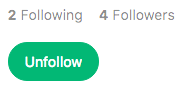

# Nformd

[Nformd live][heroku]

[heroku]: http://nformd.herokuapp.com

Nformd is a full-stack web application inspired by Medium.  It utilizes Ruby on Rails on the backend, a PostgreSQL database, and React.js with a Flux architectural framework on the frontend.  

## Features & Implementation

### Single-Page App

Nformd only ever loads a single webpage; all content is delivered on one static page.  The children of the root element, the `app` component, listen to a `SessionStore` and render content based on calls to `SessionStore.currentUser()` and `SessionStore.isUserLoggedIn()`.  Sensitive information and functionality meant only for users with accounts are kept out of the frontend of the app unless a user has been successfully authenticated.

```javascript
SessionStore.currentUser = function () {
  return Object.assign({}, _currentUser);
};

SessionStore.isUserLoggedIn = function () {
  return !!_currentUser.id;
};
  ```

### Story Rendering and Creation

On the database side, the Stories are stored in one table, which contains columns for `id`, `title`, `body`, `author_id` and `created_at`.  Upon login, all stories in the database are rendered to the `stories_index` component, a child of the `app` component (which renders the `nav_bar` above the stories).  These stories are held in the `StoryStore` until the user logs out.  

Individual stories are rendered as `story_index_item`s, subcomponents of the `stories_index`. These show the author's customizable profile picture and name, as well as the time elapsed since the story was published, the estimated read time of the story, the story's title, a 25-word preview of the story, the number of recommendations that the story has received, and finally the number of textual responses to the story. The layout of the `stories_index` page is taken directly from Medium and styled to mimic Medium almost exactly:


Story creation takes advantage of the recently released Draft.js framework for rich text editing.

### Responses

Implementing Responses started with a `comments` table in the database, which contains columns including `author_id` and `story_id`, `body`, and `created_at`.

The React component structure for responses mirrored that of stories: the `comments_index` component renders a list of `comment_index_item`s as subcomponents, along with one `comment_form` component at the top of the list, with which users can add their own responses to stories. Newly added responses are immediately rendered inline.

The responses to a given story are continuously monitored by the `CommentStore`.

`comment_index.jsx` :
```javascript
const CommentsIndex = React.createClass({

  commentForm(){
    if(SessionStore.isUserLoggedIn()){
      return(
        <CommentForm
          currentUser={ this.state.currentUser }
          storyId={ this.props.storyId } />
      );
    } else {
      return(<div />);
    }
  },

  render(){
    let _comments = this.state.comments.sort(function(a, b){
      return new Date(b.created_at) - new Date(a.created_at);
    });

    let commentIndexItems = _comments.map((comment, i) => {
      return(
        <CommentIndexItem key={ i } comment={ comment } />
      );
    });

    return(
      <div className="background">
        <div className="comment-index">
          <ul className="comment-list">
            <li className="comment-list-title">Responses</li>
            { this.commentForm() }
            { commentIndexItems }
          </ul>
        </div>
      </div>
    );
  }
});
```

### Followings

Users can follow and be followed by other users. These relationships are stored in their own `followings` table in the database. The `followings` table is a join table that joins followees to their followers (joins users back to users) from a `follower_id` column to a `followee_id` column.

Followings are maintained on the frontend in the `FollowingStore`. Because viewing another user's profile page enables a Follow/Unfollow toggle button, these relationships can quickly be created and destroyed. The users total follows and total followers are displayed directly above the button, and the totals are continuously updated in real time.





## Future Directions for the Project

In addition to the features already implemented, I plan to continue work on this project.  The next steps for FresherNote are outlined below.

### Customized User Feed

Below the user's profile, Medium displays a list of their followed users' stories, as well as their followed users' recent activity around the site (responses, recommendation, etc.). I plan to implement this feature for Nformd as well.

### Rich(er) Text editing

The cornerstone of Medium is their powerful story editing tools. I plan to utilize the wealth of currently unused Draft.js features to give users of Nformd a more robust and complete word processing experience.

### Tags

Stories cannot currently be tagged to categorize them. Implementing this feature would allow users to more quickly discover content that they find interesting.
